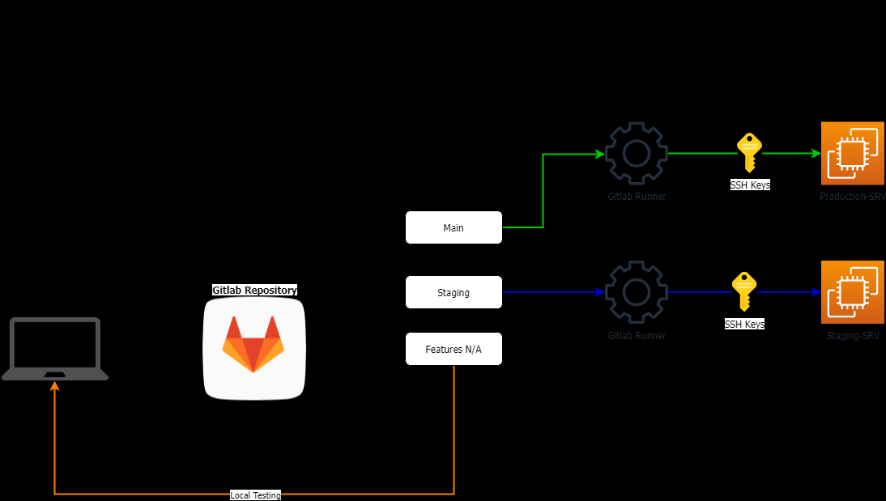

# 📑 Portofolio

## KOPS Kubernetes Cluster Provisioning

.png>) .png>) .png>)

Sebelum adanya culture DevOps , kita masih menggunakan metode waterfall dan menggunakan satu server monolith untuk satu aplikasi sehingga hal ini menyebabkan cost, performance degraded dan waktu deployment aplikasi berjalan sangat lama karena kita perlu melakukan instalasi dan pengadaan server, namun saat ini teknologi cloud dan arsitektur software dengan basis _microservice_ sangat membantu bisnis dalam kecepatan deploy apps dan pengembangan, maka dari itu perlu sistem untuk melakukan manajemen kluster salah satunya kita bisa menggunakan tools seperti Lens, K9s, Kube Dashboard, dan Rancher untuk melakukan monitoring dan deployment biasanya tools ini dipadukan juga dengan sistem monitoring lainnya seperti Prometheus, Grafana, ELK Stack, TIG Stack dll.

## Topologi kubernetes cluster AWS menggunakan KOPS

.png>)

Pada desain topologi kali ini kita akan membuat sebuah infrastruktur kubernetes cluster dan untuk provisioning sendiri kita menggunakan KOPS, untuk aplikasi sendiri kita membagi dua namespace pada kubernetes yaitu staging dan production, untuk image registry sendiri kita menggunakan Docker Hub, kemudian untuk mengakses aplikasi disini kita menggunakan servis load balancer aws yang akan membagikan traffic user kedalam pods yang tersebar dalam worker nodes kubernetes.

Disini kita memanfaatkan deployment dan kubernetes services sehingga kubernetes akan membantu kita untuk melakukan monitoring dan auto pods healing bilamana pods (container) yang rusak maka akan otomatis diganti oleh kubernetes sehingga aplikasi yang berjalan bisa lebih stabil dan pastinya meningkatkan SLA dari aplikasi yang kita miliki.

## SSH Bastion / Jumphost teknik koneksi internal resource secara aman.

.png>)

Ketika kita membangun sebuah infrastruktur salah satu aspek yang perlu kita perhitungkan adalah **Keamanan** hal ini sangat penting karena dengan melindungi resource yang tersedia dalam infrastruktur kita sama artinya kita melindungi data yang kita miliki.

Salah satu resource yang paling krusial dan perlu kita lindungi adalah **Database** ketika kita membangun infrastruktur kita sangat disarankan untuk menutup akses database kepada publik, hal ini dilakukan untuk menghindari hal yang tidak kita inginkan seperti kebocoran data yang akhir-akhir ini sering terjadi.

## Topologi AWS High Availability

Topologi yang dibangun pada AWS yang memanfaatkan 3 multiple AZ, memanfaatkan layanan S3 Bucket untuk penyimpanan konten, Auto Scalling EC2 Instance, Application Load Balancer dan Amazon RDS untuk penyimpanan databasenya, serta memanfaatkan fitur IAM untuk membagi hak akses terhadap resource yang berada didalam AWS.

Dengan desain topologi diatas diharapkan Aplikasi yang dijalankan dapat berjalan dengan baik serta mengurangi peluang downtime ketika diakses oleh banyak orang.

## Implementasi VPN Server dengan Pritunl / Openvpn pada AWS

.png>)

Untuk mengakses sistem internal yang berada pada cloud kita membutuhkan sebuah koneksi yang aman yaitu VPN, tujuan utamanya adalah agar kita dapat mengakses resource internal yang kita miliki secara aman.

## Topologi Sederhana AWS

.png>)

Dalam membangun sebuah environment pada cloud platform kita perlu melakukan desain topologi untuk desain sendiri hampir sama dengan topologi on premise namun perbedeaan yang paling utama adalah infrastruktur yang kita miliki tidak benar-benar ada melainkan berada di provider cloud yang kita gunakan, dan tentunya ada pembagian antara Jaringan private dan publik untuk faktor keamananan.

## Desain Ruangan Khusus Video Conference menggunakan logitech meetup

   

Sebelum terjadinya pandemi direksi menginginkan dibuat sistem video conference untuk menghemat cost perjalanan dinas hanya untuk monitoring pekerjaan di site project, namun tidak ada yang menyangka adanya pandemi yang membuat interaksi menjadi berat karena harus menjaga jarak, namun dengan adanya teknologi video conference yang diimplementasikan dalam perusahaan membuat koordinasi dan pengambilan keputusan menjadi lebih cepat, hal ini tentu saja sangat meningkatkan performa perusahaan dan sampai saat ini sistem video conference berjalan dengan baik.

## Implementasi Fortigate Firewall

.png>) .png>) .png>) .png>)

firewall adalah sistem keamanan jaringan komputer yang mampu melindungi dari serangan virus, malware, spam, dan serangan jenis yang lainnya. Dapat dikatakan juga bahwa, firewall merupakan perangkat lunak untuk mencegah akses yang dianggap ilegal atau tidak sah dari jaringan pribadi (private network). tugas utama dari adanya firewall sendiri adalah untuk melakukan monitoring dan mengontrol semua akses masuk atau keluar koneksi jaringan berdasarkan aturan keamanan yang telah ditetapkan, alasan paling utama dari penggunaan firewall ini adalah untuk melindungi dan membatasi penggunaan jaringan internet yang digunakan oleh user.

## Implementasi jaringan VPN pada perusahaan.

.png>)

VPN atau virtual private network merupakan sebuah teknik dalam jaringan komputer yang bertujuan untuk menghubungkan jaringan lokal pada suatu tempat dengan jaringan yang kita miliki, beberapa keuntungan yang bisa kita temui adalah kemudahan dalam melakukan remotting perangkat jaringan lokal, traffic yang terkenkripsi membuat komunikasi lebih aman serta memungkinkan kita sebagai admin dalam manajemen perangkat dari jarak jauh / remote.

## Fail Over Koneksi Internet

.png>)

Failover adalah salah satu metode pada jaringan untuk menghindari down time koneksi. Dan sering digunakan jika memiliki lebih dari 1 sumber internet. Cara kerja dari failover, akan terdapat minimal 2 link atau jalur menuju ke internet. Jalur 1 akan berfungsi sebagai main link atau jalur utama.

## Load Balancer Koneksi Internet

.png>)

Load balancing adalah proses pembagian beban _traffic_ sebuah aplikasi atau server. Dengan load balancer, beban traffic tidak akan dibebankan kepada beberapa jalur koneksi.

Hal ini mempercepat waktu respons internet dalam mengakses resource pada internet dan mencegahnya _overloading traffic_. Dengan begini, kinerja internet akan lebih maksimal tidak peduli berapa banyak traffic yang Anda dapatkan.

## Implementasi VLAN untuk memisahkan jaringan secara virtual

.png>)

VLAN (Virtual LAN / Virtual Local Area Network) adalah domain broadcast yang dipartisi dan terisolasi dalam jaringan komputer pada lapisan data link. Topologi VLAN adalah bentuk jaringan dengan model LAN sangat bergantung pada letak workstation. VLAN berfungsi untuk menyediakan layanan secara tradisional. pada umumnya VLAN diimplementasikan sebagai faktor keamanan, cost reduce serta membantu Admin untuk memudahkan dalam manajemen jaringan.

## Topologi Jaringan LAN Sederhana

.png>)

Untuk jaringan lokal berskala kecil biasanya hanya terdiri dari modem, router, switch, access point dan untuk client dapat berupa PC, Laptop atau Smartphone, pada case kali ini kita menggunakan jaringan LAN dengan network 192.168.50.0/24 dan alamat IP router sebagai gateway menuju jaringan internet 192.168.50.1 untuk mengakses konfigurasi router kita gunakan IP Address 192.168.50.254 dan kita menggunakan IP Publik 182.223.113.242 untuk akses internet sendiri kita akan menggunakan firewall NAT.

## Implementasi Zabbix Sebagai Network Monitoring System

.png>)

Untuk memastikan status infrastruktur yang kita miliki berjalan dengan aman kita perlu melakukan monitoring salah satunya adalah kita bisa menggunakan Zabbix network monitoring&#x20;

## Implementasi Quality Of Service Pada Jaringan Komputer

 (1).png>)

Quality Of Service adalah sebuah teknik dalam jaringan komputer untuk menjamin berjalannya traffic secara lancar dan minim interfrensi meskipun traffic yang berjalan sedang padat, hal ini dapat dicapai dengan melakukan klasifikasi traffic, mengurutkan prioritas traffic, dan bandwidth control.
